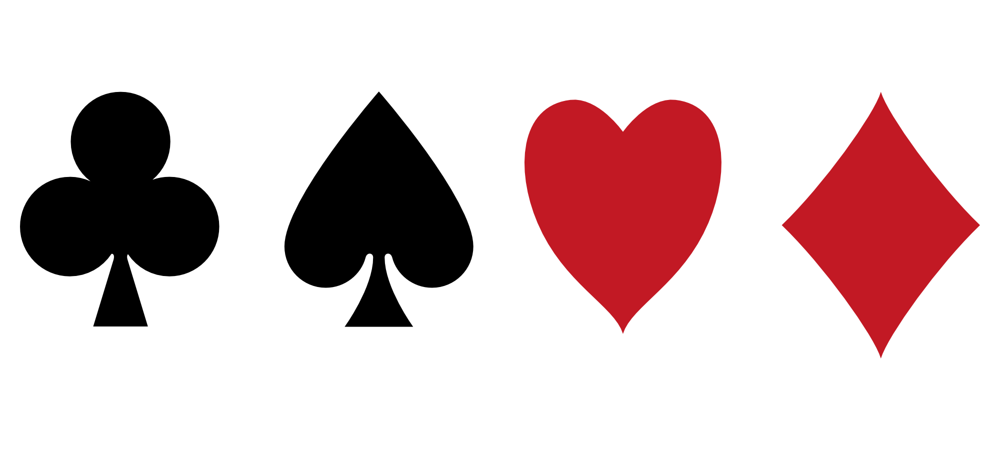

# librejack

Librejack is simple a blackjack clone written in java.

## Rules of the game

1. The game is played with a single, standard Deck of 52 cards (for now).
2. Players start with two cards and have an option to hit (draw another card) or stand (end their turn).
3. Normal cards are valued at their number, Face cards (Jack Queen and King) are valued at 10, and aces can be valued at 11 or 1.
   - If the value of the hand with an ace puts it over 21, the ace is valued at 1. If it's doesn't, it's 11.
4. If the Player starts with 21, they automatically get BlackJack and win. If the dealer starts with 21, the player loses automatically, before they even get a chance to hit or stand. If they both get 21 in the end, it's a push (a draw/tie).
5. The player may stand (stop drawing) at any time. If they go over 21 they bust and lose. When the player stands, it's the end of their turn, and the dealer begins drawing their third, fourth, fifth card, and so on.
6. The dealer will keep drawing cards until they reach a hand valued at 17 or higher.
7. If neither player nor dealer busts or gets BlackJack, the player with the highest score wins the round.
8. If you run out of cards, the deck is shuffled and you start over.

## Prerequisites

Before you begin, ensure you have [Java](https://www.java.com/en/download/) installed on your system.

## Installing *librejack* 

- Download the `.zip ` or `.tar.gz` file from the [releases tab](https://github.com/michaelneuper/librejack/releases).
- Extract all the files.
- Run the `librejack.jar` file (make sure it is in the same directory as the `lib` folder).

## Documentation

Documentation for the source code can be found [here](https://michaelneuper.github.io/librejack/)

## Directories
- `db` constains databases.
- `docs` contains documentation.
- `lib` contains external libraries.
- `nbproject` contains netbeans metadata.
- `src` contains the source files.

## License

This project uses the following license: [GPL v3](https://github.com/michaelneuper/librejack/blob/main/LICENSE.txt).
